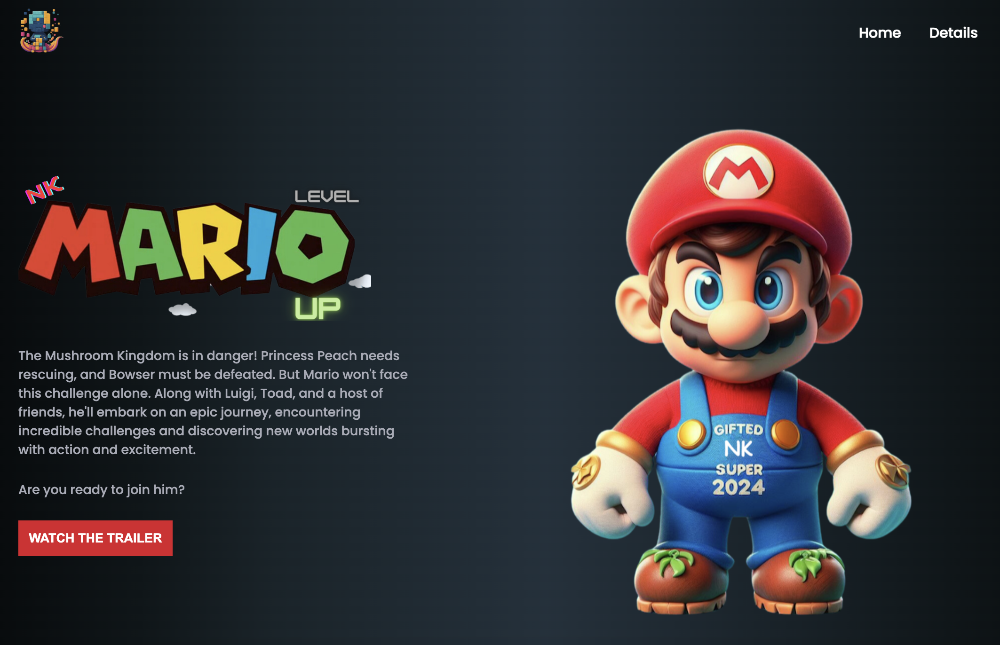

# Mario Game Dev | Be Ready for the Next Release: Movie, Games, and Anime Trailers!

Welcome to the **Mario Game Dev** project! This project showcases a web-based platform dedicated to the latest trailers for movies, games, and anime, featuring the beloved Mario universe. 

## Table of Contents

- [Demo](#demo)
- [Features](#features)
- [Installation](#installation)
- [Usage](#usage)
- [Project Structure](#project-structure)
- [Customization](#customization)
- [Contributing](#contributing)
- [License](#license)
- [Acknowledgements](#acknowledgements)

## Demo



Check out the live demo [here](#) soon.

## Features

- **Modern Web Design:** Sleek and responsive layout with a vibrant aesthetic.
- **Trailer Playback:** Embedded video player to watch the latest trailers.
- **Mario-Themed UI:** Engaging visuals featuring Mario characters and elements.

## Installation

To get started, clone this repository and set up your development environment.

1. Clone the repo:
   ```bash
   git clone https://github.com/your-username/your-repo.git
   cd your-repo
   ```

2. Install dependencies:
   ```bash
   npm install
   ```

## Usage

1. **Start the Development Server:**
   ```bash
   npm start
   ```
   The site will be available at `http://localhost:3000`.

2. **Build for Production:**
   ```bash
   npm run build
   ```

## Project Structure

```
.
├── src
│   ├── css
│   │   ├── reset.css
│   │   ├── style.css
│   │   └── responsive.css
│   ├── images
│   │   ├── contentcove-icon.ico
│   │   ├── mario-logo.png
│   │   ├── super-mario-bros-title.png
│   │   ├── super-mario-chars.png
│   │   └── screenshot.png
│   ├── js
│   │   └── index.js
│   ├── index.html
│   └── ...
```

- **`css/`**: Contains the CSS files for styling the website.
- **`images/`**: Includes images used in the website.
- **`js/`**: Contains JavaScript for interactive features.
- **`index.html`**: The main HTML file.

## Customization

Feel free to modify and extend the project to suit your needs. Update the CSS in `style.css` and `responsive.css` to match your desired design. Customize `index.html` to change the structure or content.

### Video Modal

The video modal is implemented with the following CSS:

```css
.video-modal {
  display: none;
  justify-content: center;
  align-items: center;
  position: fixed;
  top: 0;
  left: 0;
  width: 100%;
  height: 100%;
  background-color: rgba(0, 0, 0, 0.8);
  z-index: 1000;
}
.video-container {
  position: relative;
  width: 100%;
  max-width: 700px;
}
.video-container video {
  width: 100%;
  height: auto;
}
.close-btn {
  position: absolute;
  top: 10px;
  right: 10px;
  background: #fff;
  border: none;
  border-radius: 50%;
  width: 30px;
  height: 30px;
  display: flex;
  justify-content: center;
  align-items: center;
  font-size: 20px;
  cursor: pointer;
}
```

You can adjust the styling to enhance the modal's appearance as needed.

## Contributing

Contributions are welcome! Please open an issue or submit a pull request for any improvements or bug fixes.

## License

This project is licensed under the MIT License - see the [LICENSE](LICENSE) file for details.

## Acknowledgements

The project is a modified version of [The_Content-Cove_Project](https://github.com/juletopi/The_Content-Cove_Project) by Júlio Cézar.

- [Júlio Cézar](https://github.com/juletopi) for the original [The_Content-Cove_Project](https://github.com/juletopi/The_Content-Cove_Project).
- [Mario and related characters](https://www.nintendo.com/) by Nintendo.

